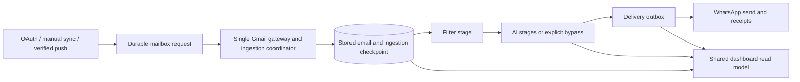

# Pipeline audit and remediation — 22 September 2026

## Scope and evidence

Reviewed settings persistence, dashboard hydration and status reporting, Gmail OAuth/watch/history/manual import paths, processing stages and job orchestration, WhatsApp delivery, and error-log isolation. This is a targeted reliability audit, not a claim that every defect in the application has been discovered.

Evidence: the supplied screenshots/production stack, repository source, installed Supabase request-builder implementation, offline regression tests, and authorized read-only queries against the configured Supabase project. Existing uncommitted work was preserved. No deployment, schema migration, or outbound message was performed.

## Live database findings

Read-only snapshot on 22 September 2026:

- **82 log records** returned, spanning 8–21 September. **69** are `HISTORY_MESSAGE_INGEST_FAILED`; the latest examples match the screenshot's “Requested entity was not found.” The recorded fields omit the HTTP status, so deletion versus wrong-account access cannot be established retrospectively.
- **One saved settings row** has `disable_processing: true` and **no `pipeline` object**. The current compatibility reader therefore resolves Receive=true, Filter=false, AI=false, WhatsApp=false. The observed refresh behavior is consistent with these persisted values and the confirmed write-filter bug. These settings were not changed during the audit.
- Exact job-status counts: **2,446 completed; 0 pending; 0 running; 0 retrying; 0 failed**. There was no stuck-job backlog at the time of the query. Crash recovery remains a code-level risk rather than an observed current backlog. “Completed” is a job status, not proof that ignored writes or external sends succeeded.

| Other log code | Count | Interpretation / next action |
| --- | ---: | --- |
| `GMAIL_MESSAGE_FETCH_FAILED` | 1 | Invalid Google authentication credentials. Verify token refresh/revocation and reconnect the affected account if still failing; do not misclassify as a missing message. |
| `STAGE_RETRY_SCHEDULED` | 4 | Three filtration, one ingestion. Examples include a missing stored message and a generic pre-filter failure. Inspect tenant access and message retention/deletion; logs alone do not prove which caused the missing message. |
| `PRE_FILTER_FAILED` | 1 | Generic filter failure with no technical details. Preserve the underlying database/provider error in future logs. |
| `META_24H_SESSION_EXPIRED` | 1 | Log describes a closed WhatsApp customer messaging window. Keep this delivery-local and use the supported template/reply flow. |
| `WHATSAPP_SESSION_WINDOW_OUTSIDE_24H` | 1 | Another window-closure event; log claims template fallback. Confirm actual delivery from provider receipts. |
| `GMAIL_HISTORY_ID_EXPIRED` | 1 | Log records expired history and recovery. Current bounded fallback is insufficient for complete reconciliation. |
| `AI_GEMINI_FALLBACK_TRIGGERED` | 1 | Log reports rate limiting and fallback. Treat degraded AI behavior separately from ingestion health. |
| `DATA_RETENTION_CLEANUP_COMPLETED` | 1 | Informational successful cleanup, not an error. |
| `ACTION_ITEMS_EXTRACTED` | 1 | Informational success. |
| `AUTOMATED_DAEMON_DISCARDED` | 1 | Informational filtering outcome. |

These are persisted records, not independent confirmation of provider outcomes. Several older records use event codes absent from the current runtime; they may originate from older code or seeded data. Do not assume every historical dashboard row is a current incident.

## Diagnosis of the ingestion errors

The supplied error was emitted by the old per-message history import loop. A `messages.get` 404 means a message is unavailable in the authenticated mailbox (for example, deletion after history enumeration). The historical logs do not establish the actual HTTP status or exclude an account mismatch. A `history.list` 404 instead requires reconciliation from a new full-sync baseline. See [Google synchronization documentation](https://developers.google.com/workspace/gmail/api/guides/sync).

The new coordinator verifies mailbox identity, treats only individual message-fetch 404s as unavailable-message skips, persists an aggregate warning, and recovers expired history through paginated full reconciliation followed by history replay. Other failures retain progress for retry.

## Implemented in this workspace

| Problem | Fix |
| --- | --- |
| Saved controls reverted after refresh | Correct JSON serialization in the Supabase optimistic-lock filter; API returns persisted controls; both dashboard routes use one settings/read model. |
| Refresh discarded unsaved edits | Preserve dirty pipeline/settings drafts, including rule removals; show save errors. |
| Misleading active/AI/delivery cards | Derive controls from stored preferences, use database aggregate counts, distinguish bypassed AI and accepted versus delivered WhatsApp messages. |
| Several Gmail entry paths and overlapping imports | One Gmail gateway and one durable ingestion coordinator for OAuth, manual sync and verified push. Tabs read stored data. |
| Incomplete history and expired-cursor recovery | Persist page progress; full reconciliation captures a baseline and replays history; commit imported messages, jobs and cursor progress atomically. |
| Watch/reconnect could skip mail | Watch renewal cannot advance ingestion history; reconnect preserves its checkpoint. |
| Lost stage work after crashes or partial writes | Database leases, bounded retries, fenced ownership, unique successors, and atomic output/completion/handoff. Successful predecessor outputs remain stored. |
| Duplicate sends or false delivery success | Durable outbox, explicit ambiguous-send state, provider IDs, signed receipt reconciliation, and no automatic retry of uncertain sends. Legacy unconfirmed delivery is not presented as handset-confirmed. |
| Browser-driven work | Scheduled worker performs bounded ingestion, processing and delivery independently. |
| Webhook and cron authentication gaps | Required cron secret, verified Pub/Sub OIDC identity/audience, mandatory Meta signature validation, and tenant-owned interaction lookup. |
| Error-log isolation and silent writes | User-scoped error reads, service-role requirement, checked critical writes and visible settings errors. |
| Missing dashboard message time | Incoming message display includes date and time with explicit Asia/Kolkata timezone. |
| Incomplete schema baseline | Additive migration supplies missing fields, durable queues/outbox, RLS, restricted RPCs, counts and recovery backfill; transactional migration runner tracks checksums. |

## Layer contract

Each stage owns its output and failure. A downstream failure cannot undo imported email or completed classification. Optional disabled stages bypass explicitly; a failed required stage stops its own downstream progression while other messages continue. The four controls remain independently persisted. Disabling WhatsApp prevents queued sends when the worker rechecks settings.

## Verification and remaining activation work

Application regression tests and actual PostgreSQL-engine tests (PGlite) pass. They cover real-client settings serialization, resume cutoffs, stage isolation, bypass behavior, outbox preparation, Gmail status classification, fail-closed authentication, atomic page persistence, exclusive claims, stale-lease fencing/recovery, transaction rollback, receipt ordering and database grants/RLS. TypeScript passes.

The migration is **not applied**: `DATABASE_URL` is absent from the local environment. Provider credentials, authenticated UI save/refresh, and deployment configuration still need environment-level verification. No external message was sent and nothing was deployed. The production Webpack build passed; lint completed with 0 errors and 22 warnings. The original Turbopack build stalled. Detailed results are recorded in the implementation runbook.

Known boundaries: analytics over the loaded email list still cover at most 1,000 messages; overview/processing aggregate counts come from the database. Unknown WhatsApp outcomes require operator/provider reconciliation, not blind resend. Scheduled greeting/template flows remain separate from the email-alert outbox. Browser verification was unavailable because computer-use permission was denied. This targeted audit does not establish that unrelated application features are defect-free.

See [implementation and activation instructions](pipeline-implementation.md).
